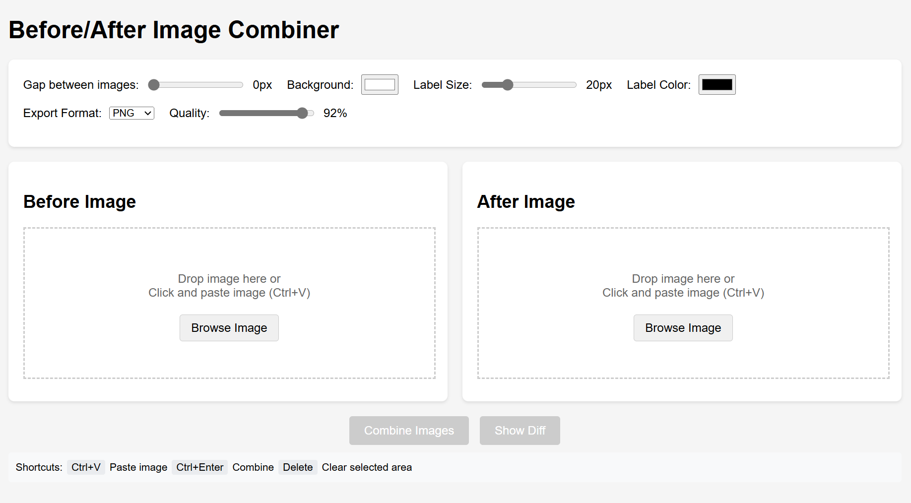

# BeforeAfter

A browser-based tool for comparing and combining before/after images. No server needed, runs entirely in your browser.

## Features

- 📸 Combine before/after images side by side or vertically
- 📐 **Multiple Aspect Ratios**:
  - `Auto` (Original dimensions)
  - `1:1` (Square - Instagram / Facebook feed)
  - `4:5` (Portrait - Instagram post)
  - `5:4` (Landscape 5:4)
  - `16:9` (Widescreen - YouTube / Presentation)
  - `9:16` (Story / Reels / TikTok / Shorts)
- 🔍 **Interactive Zoom & Pan**:
  - Zoom in & out independently or with linked sync (`20%` - `500%`)
  - Mouse wheel zoom (cursor-centered)
  - Click & drag to pan/reposition images for precise framing
  - 🔗 **Sync Zoom & Pan**: Synchronize scaling and position between Before & After
  - Fit Modes: `Cover` (fill & crop) and `Contain` (fit full image)
- 🔎 **Visual Diff Tool** to highlight changes between images
- 📋 Paste images directly from clipboard (`Ctrl+V` / `⌘+V`)
- 📥 Drag and drop support & file browsing
- 🎨 Customizable:
  - Background color
  - Custom label text ("Before" / "After" or custom)
  - Label size, color, and position (Top / Bottom / Hidden)
  - Gap between images
  - Export format (`PNG`, `JPEG`, `WEBP`) and quality
- 💾 Download high-resolution combined or diff images
- 📋 One-click copy image to clipboard
- ⛶ Fullscreen lightbox preview & result zoom
- 📱 Mobile-friendly with touch drag support
- 🚀 Runs 100% in browser, no server or installation required

## Usage

1. Open `index.html` in any web browser
2. Add images using:
   - Paste from clipboard (`Ctrl+V` / `⌘+V`)
   - Drag and drop
   - File browser ("Browse Image")
3. Choose your desired **Aspect Ratio** (`1:1`, `16:9`, `9:16`, `4:5`, `5:4`, or `Auto`)
4. **Zoom & Pan** each image using mouse wheel or sliders to frame the subject perfectly
5. Customize layout, gap, background color, and labels
6. Download the result or copy it directly to your clipboard!

## Keyboard Shortcuts

- `Ctrl+V` / `⌘+V` - Paste image
- `Ctrl+Enter` / `⌘+Enter` - Combine images
- `Delete` / `Backspace` - Clear selected area
- `Mouse Wheel` - Zoom in / out over image viewport
- `Click & Drag` - Pan image inside slot

## License

[MIT](LICENSE)